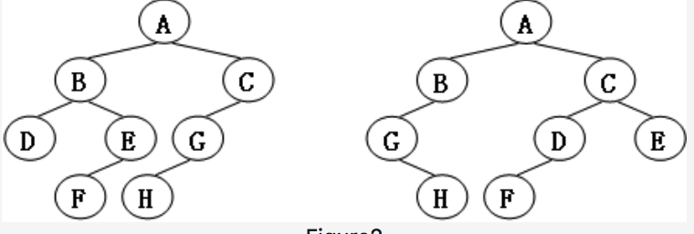

//Copy from PTA\
Two trees, T1 and T2, are isomorphic if T1 can be transformed into T2 by swapping left and right children of (some of the) nodes in T1. For instance, the two trees in Figure 1 are isomorphic because they are the same if the children of A, B, and G, but not the other nodes, are swapped. Give a polynomial time algorithm to decide if two trees are isomorphic.


# Format of function
```c
int Isomorphic( Tree T1, Tree T2 );
```
where Tree is defined as the following:
```c
typedef struct TreeNode *Tree;
struct TreeNode {
    ElementType Element;
    Tree  Left;
    Tree  Right;
};
```
The function is supposed to return 1 if T1 and T2 are indeed isomorphic, or 0 if not.

# Sample program of judge:
```c
#include <stdio.h>
#include <stdlib.h>

typedef char ElementType;

typedef struct TreeNode *Tree;
struct TreeNode {
    ElementType Element;
    Tree  Left;
    Tree  Right;
};

Tree BuildTree(); /* details omitted */

int Isomorphic( Tree T1, Tree T2 );

int main()
{
    Tree T1, T2;
    T1 = BuildTree();
    T2 = BuildTree();
    printf(“%d\n”, Isomorphic(T1, T2));
    return 0;
}

/* Your function will be put here */

```

# Sample Output 1 (for the trees shown in Figure 1):
>1
# Sample Output 2 (for the trees shown in Figure 2):
>0



