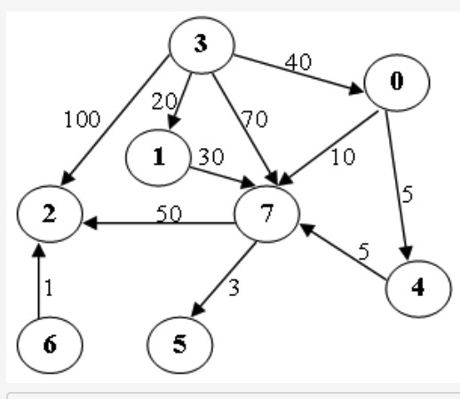

//Copy from PTA\
Write a program to not only find the weighted shortest distances, but also count the number of different minimum paths from any vertex to a given source vertex in a digraph. It is guaranteed that all the weights are positive.


# Format of function
```c
void ShortestDist( MGraph Graph, int dist[], int count[], Vertex S );
```
where MGraph is defined as the following:
```c
typedef struct GNode *PtrToGNode;
struct GNode{
    int Nv;
    int Ne;
    WeightType G[MaxVertexNum][MaxVertexNum];
};
typedef PtrToGNode MGraph;
```
The shortest distance from V to the source S is supposed to be stored in dist[V]. If V cannot be reached from S, store -1 instead. The number of different minimum paths from V to the source S is supposed to be stored in count[V] and count[S]=1.

# Sample program of judge:
```c
#include <stdio.h>
#include <stdlib.h>

typedef enum {false, true} bool;
#define INFINITY 1000000
#define MaxVertexNum 10  /* maximum number of vertices */
typedef int Vertex;      /* vertices are numbered from 0 to MaxVertexNum-1 */
typedef int WeightType;

typedef struct GNode *PtrToGNode;
struct GNode{
    int Nv;
    int Ne;
    WeightType G[MaxVertexNum][MaxVertexNum];
};
typedef PtrToGNode MGraph;

MGraph ReadG(); /* details omitted */

void ShortestDist( MGraph Graph, int dist[], int count[], Vertex S );

int main()
{
    int dist[MaxVertexNum], count[MaxVertexNum];
    Vertex S, V;
    MGraph G = ReadG();

    scanf("%d", &S);
    ShortestDist( G, dist, count, S );

    for ( V=0; V<G->Nv; V++ )
        printf("%d ", dist[V]);
    printf("\n");
    for ( V=0; V<G->Nv; V++ )
        printf("%d ", count[V]);
    printf("\n");

    return 0;
}

/* Your function will be put here */


```

# Sample Input (for the graph shown in the figure):

>8 11\
>0 4 5\
>0 7 10\
>1 7 30\
>3 0 40\
>3 1 20\
>3 2 100\
>3 7 70\
>4 7 5\
>6 2 1\
>7 5 3\
>7 2 50\
>3

# Sample Output 
>40 20 100 0 45 53 -1 50 \
>1 1 4 1 1 3 0 3 


